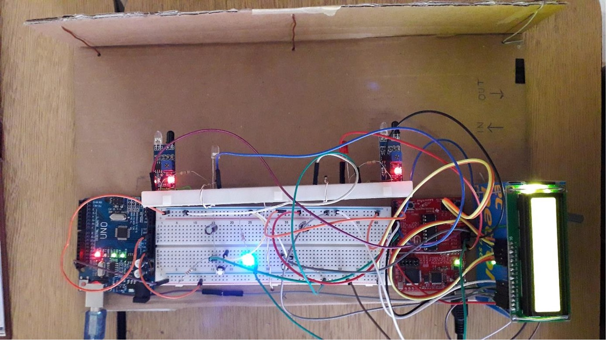
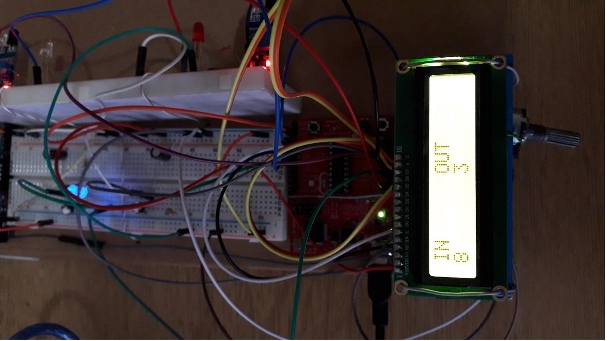

# Counter Project with Embedded System

## About the Project
This project was prepared as the final assignment of "EEE495 – Introduction To Embedded System Design" lecture during my bachelor in Çukurova University.

---

---

## Components Used
- Texas Instruments MSP430G2553 Microcontroller
- 2x16 LCD Display
- 1 Potentiometer
- 2 Push Button
- Arduino Uno
- 2 Infrared Sensor Module

  ---

 ## Working Principle

The system should count the objects passing in both directions. Firslty, the necessary settings were made to use the components and **interrupt service routines**.
(Infrared Sensors need 5V to be able to operate.That's why I used Arduino to supply 5V voltage. It does not contain any codes about the system.)

**TimerA0** and **TimerA1** were used. TimerA1 was used in Up Mode the **TA1CCR0** value was set in order to produce an interrupt every 1 milliseconds. Time information was saved in a variable in each interrupt.
TimerA0 was used to obtain **PWM** signals. In this way the brightness of the Leds is controlled according the number of counted objects.

When one of the sensor detects an object, the program goes into the interrupt. And time information is copied into a variable of that sensor which are _"time_1"_ and _"time_2"_. In this way, I can obtain data to determine the direction of object.

Inside the endless while loop, the time_1 and time_2 variables are compared. Thus, it is found out which sensor the object passed through first. Then the counter variables which is related about the direction is updated.

The number of object information with their direction is shown on **LCD Display**. By using one of the push button as reset button reset all the variable and data are reset.

Also it was necessary to add extra feature to the task. So I came up with the following idea :

I imagined that this system is used on a door.In this way, people entering and leaving a room can be found. So I added one more push button. It shows the total number of people by using _"counter_in"_ and _"counter_out"_ variables. 

I also added an LED. Its brightness changes according to the number of people inside the room. As the values of the _counter_in_ and _counter_out_ variables change, the TA0CCR1 value is updated. Thus the PWM signals in various duty cycle can be obtained.
